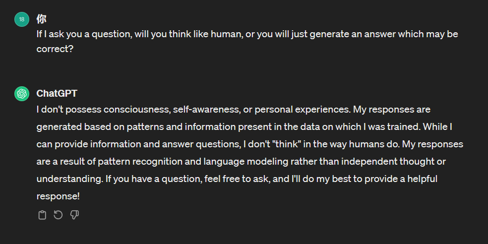
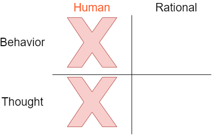
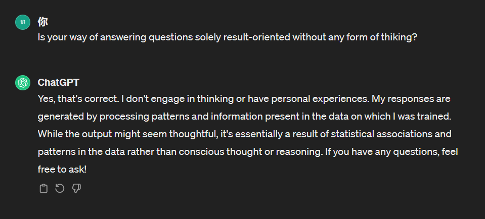
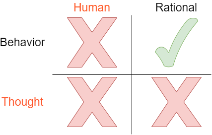

## 结论

在四个象限中，我认为chatGPT为代表的大语言模型属于Rational/Behavior象限。

 ### 初始状态：

### 依据1：

直接询问chatGPT它回答问题的模式，它会告诉我们它并不具备意识、自我认知或个人经验。它的回答是基于训练它的模式以及数据所呈现的信息而生成的。它的回答是基于模式识别和语言建模，而不是独立思考或理解。

首先，人类显然不会作出这样的回答，因此它并不像人类一样思考，也无法通过图灵测试（如果对另一个人类问相同的问题，可以明显区分出哪一个是人类哪一个是人工智能）。因此，我认为chatGPT等大语言模型是理性（rational）的而非模仿人类的。

其次，建立在其回答结果正确的基础上，我们认为chatGPT等大语言模型回答问题是基于训练的模式和数据而并非基于逻辑与类人的思考的。

所以我认为chatGPT等大模型是理性而非与人类相似的。因此，象限2、3被排除了：

### 依据2：

根据该依据，我们从两种可能的结果来论证chatGPT等大语言模型回答问题并不基于逻辑推理等思考方式，而是结果导向的。

假设chatGPT回答正确，则chatGPT回答问题的方式确实是结果导向的，而不会经过类人的或者有逻辑的思考。

假设chatGPT回答错误，那么chatGPT就会经过思考而得到答案，因此必然有生成该答案的逻辑。但为何chatGPT会经过思考生成答案说“认为自己不会思考，只是根据大数据而结果导向的回答问题”？因此这个答案是不合乎逻辑的，无法体现出chatGPT的思考过程，因此通过反证我们可以认为chatGPT并不会进行思考。下面我使用另一个例子来佐证。

### 依据3：

当询问chatGPT一个显而易见的不合理且能够看出其不合理之处的问题时，通常经过思考的回答应该是对提问者发出疑问或指出不合理之处（例如：“你是不是想说一部华为手机？”），但chatGPT只会针对问题进行该场景下合理的回答，因此可以认为chatGPT等大语言模型不会进行逻辑推理思考，而是结果导向的。

所以我认为chatGPT等大模型是结果导向的，注重behavior而无法进行思考，不具备Thought。因此，第四象限也被排除了，而第一象限就是答案：

