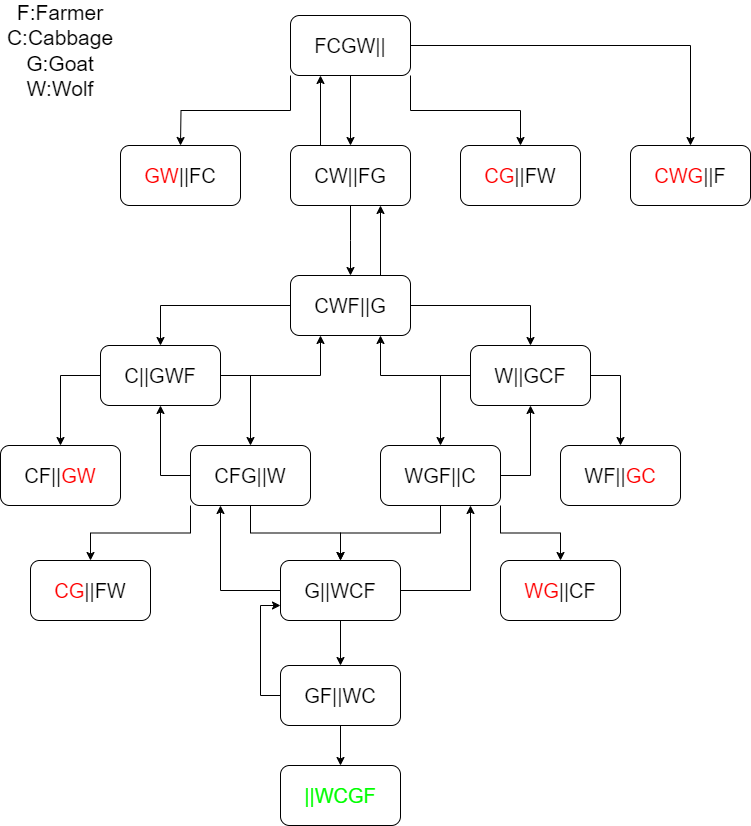
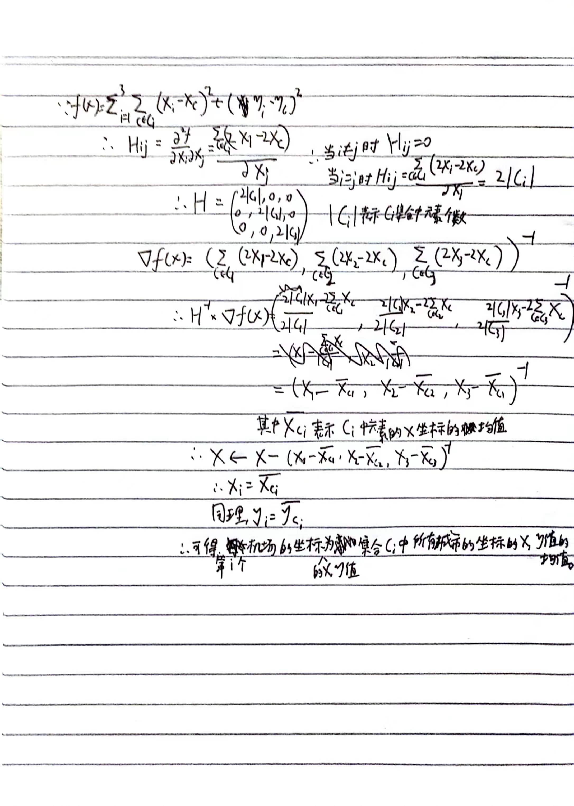
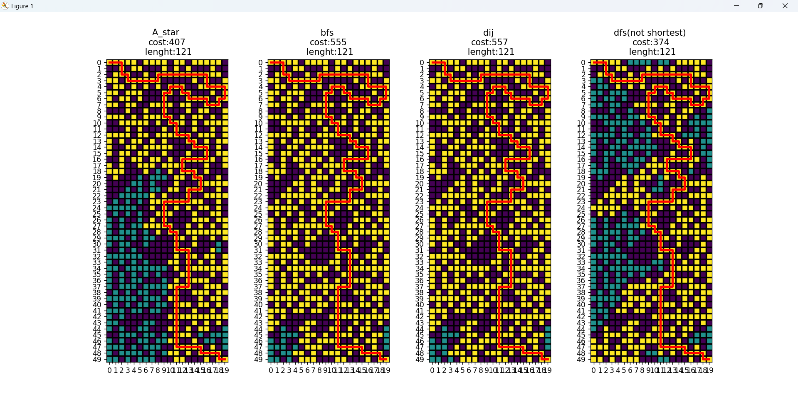
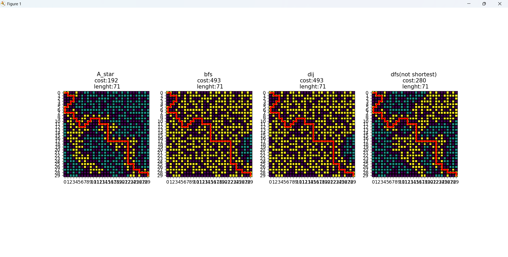
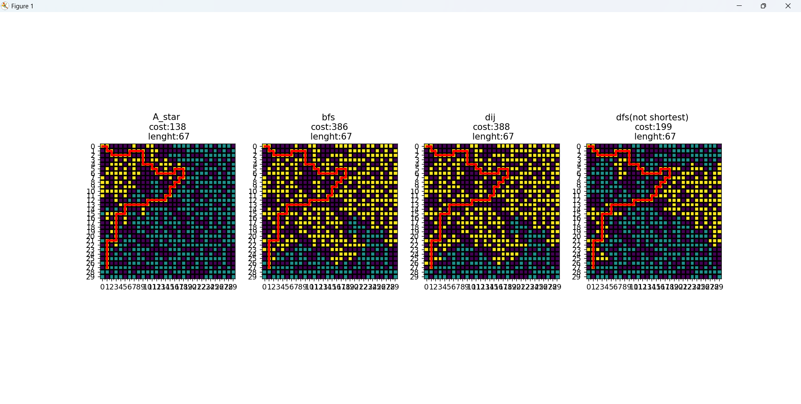
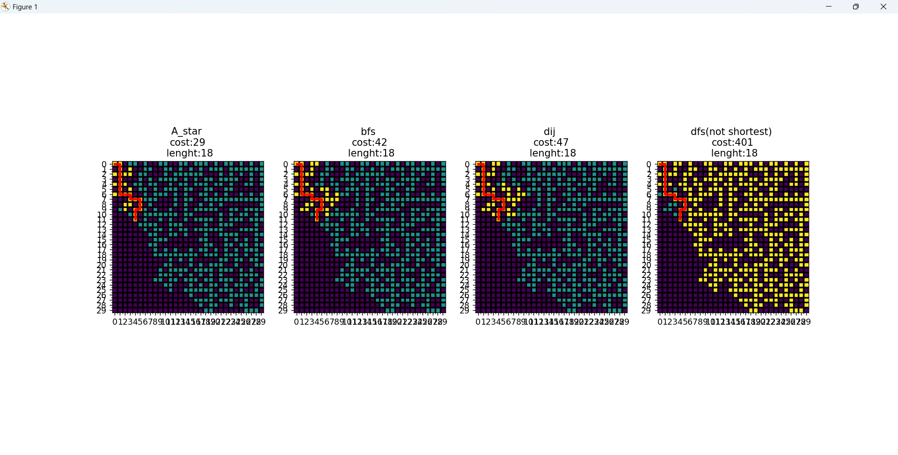

## 1.过河问题

## 2.机场问题

### 1-1 bfs

点数N，边数M

时间复杂度：O(M)	（会遍历所有从起点能走到的边（两次），因此复杂度为M）

空间复杂度：O(N+M)

### 1-2 朴素dij

点数N，边数M

时间复杂度：O(N+M)	(每次循环要遍历所有节点找距离最小且未找过的节点，因此复杂度要加上N，影响的情况主要是图中边数少而点数多的情况)

空间复杂度：O(N+M)

### 1-3 dij

使用c++ stl自带优先队列实现

点数N，边数M

时间复杂度：O(MlogM） (优先队列维护点集合时集合内最多M级别个点（会有重复），因此复杂度为MlogM)

空间复杂度：O(N+M)

### 2-1 八数码 dfs

由于八数码问题dfs的递归层数较深，所以使用传统的函数递归实现dfs会由于函数连续调用过多爆栈。因此使用deque（或者stack也可）来实现递归。

使用unordered_set记录经历过的状态。

### 2-2 八数码 bfs

使用unordered_map记录经历过的状态和所需到达的最小距离。

### 2-3 八数码 dij

和bfs差不多，将维护数据的数据结构从队列换成了优先队列。

### 2-4 八数码 A-star

估值函数使用每个点（除x以外）与自身原点的曼哈顿距离和。由于每次x移动时最多将一个点离其原点的距离移近一格，所以该估值函数的估值步数必定小于等于实际所需的步数。所以当优先队列pop出终止状态时就是最优解情况。

对每个节点记录到达该节点的父节点，找到最终状态后反向迭代节点成父节点直到找到初始状态，该过程中形成的路径反转后就是初始状态到最终状态的最短路径。

优化点：

使用unordered_map记录状态对应的估值，用以避免单个状态多次入队时重复的估值计算。

### 3 迷宫问题

黄色点为遍历过的点，蓝色的为未遍历过的可达点。红色路径为搜索到的（最短）路径。深紫色点为墙壁。dfs不保证能够搜到最短路径，因为dfs如果要搜最短路径需要全部搜索一遍才行。

效果图：

功能：

可自定义地图长宽大小，随机生成地图

可以指定终点在地图右下角，也可以随机生成一个终点（保证可达）

随机终点如图：

